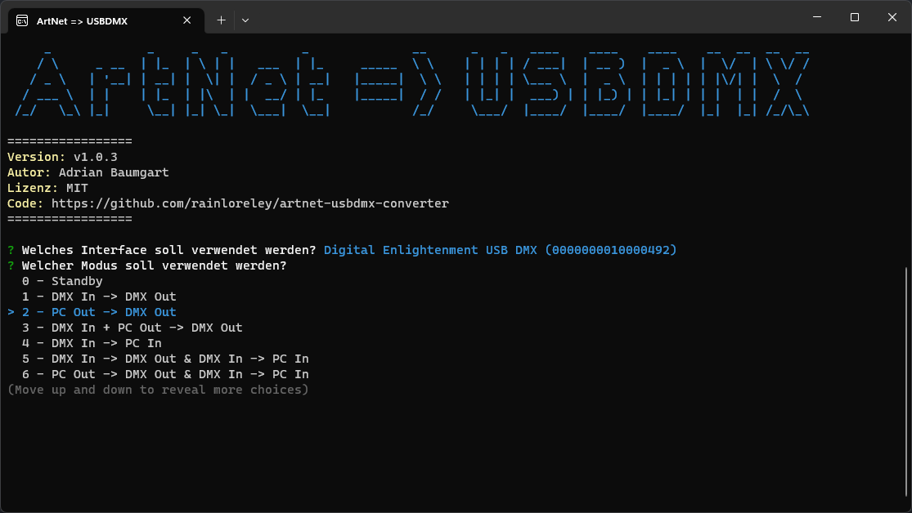

# ArtNet-USBDMX-Converter



Send incoming ArtNet signals to the FX5 DMX interface (and other [compatible interfaces](#compatible-interfaces)) to make it compatible with most DMX control programs.
# Use case

This application opens an ArtNet receiver, to which various DMX control programs (e.g. ChamSys MagicQ) can send DMX signals to.
It then forwards these signals to the FX5 USBDMX interface, and therefore opens it up to a variety of programs, not only the few that support it (QLC+, DMXControl).

# Compatible interfaces

- FX5 DMX Interface (Frank Sievertsen)
- [Nodle U1](https://www.dmxcontrol.de/interfaces/nodle-u1-interface.html) (DMXControl e.V.)
- [Nodle R4S](https://www.dmxcontrol.de/interfaces/nodle-r4s-interface.html) (DMXControl e.V.)
- Technically any interface which uses the [usbdmx driver](https://github.com/fx5/usbdmx) by Frank Sievertsen
  - Won't work out of the box, vendor ID and product ID need to be added manually

# Develop & Build

## Development
```bash
git clone https://github.com/rainloreley/artnet-usbdmx-converter.git
cd artnet-usbdmx-converter
yarn
yarn dev
```

## Compiling
```bash
# edit package.json -> pkg to add more targets for various platforms
yarn make
```

# License

This project is licensed under the MIT License - see the [LICENSE](LICENSE) file for details
